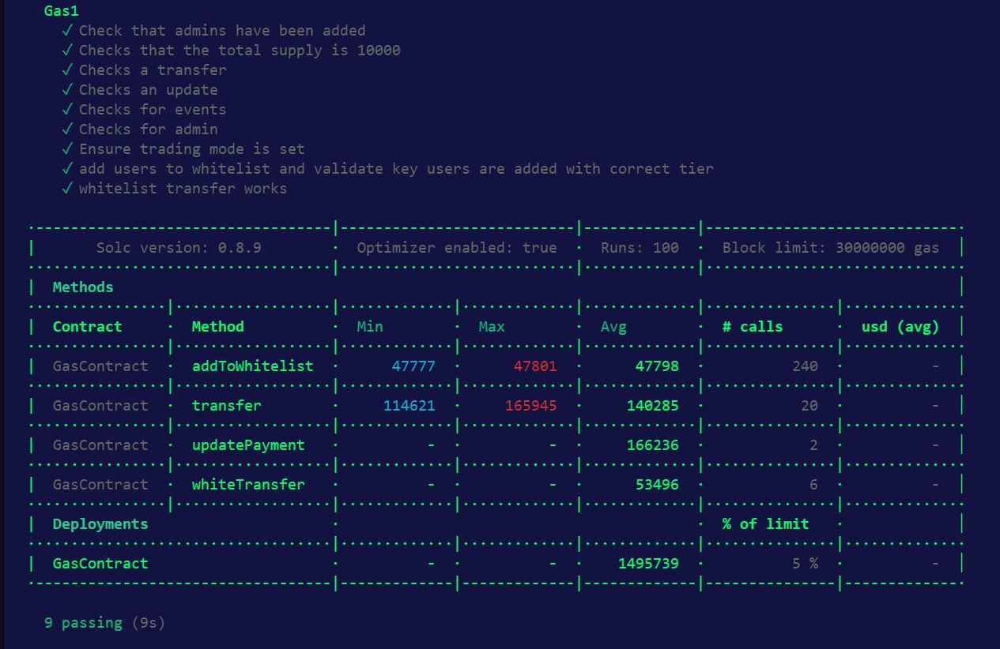

# Optimisation Game Instructions

1. Open a terminal go to the Gas directory
2. Run ` npm i` to install the dependencies
3. Run ` npx hardhat test` to run the tests and get a gas usage report

The aim of the game is to reduce the Average figures for contract deployment and transfer and updatePayment functions as much as possible.

You can change the contract as much as you like.
You **cannot** \* change the tests, and all the tests must pass.

\* you can slightly adjust tests for whitelist functions if you need so.

**Gas Cost Before Optimization**

**Gas Cost After Optimization**

**Gas Cost Optimization - After Changing Admin Array To Admin Mapping**
